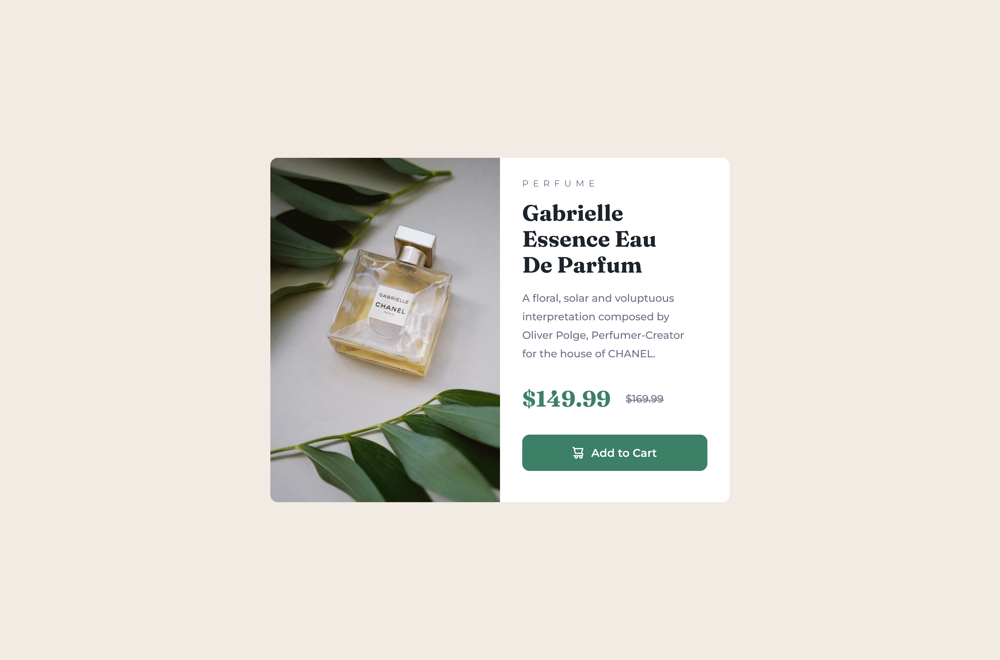

# Frontend Mentor - Product preview card component solution

This is a solution to the [Product preview card component challenge on Frontend Mentor](https://www.frontendmentor.io/challenges/product-preview-card-component-GO7UmttRfa). Frontend Mentor challenges help you improve your coding skills by building realistic projects.

## Table of contents

- [Overview](#overview)
  - [The challenge](#the-challenge)
  - [Screenshot](#screenshot)
  - [Links](#links)
- [My process](#my-process)
  - [Built with](#built-with)
  - [What I learned](#what-i-learned)
  - [Continued development](#continued-development)
  - [Useful resources](#useful-resources)
- [Author](#author)
- [Acknowledgments](#acknowledgments)

## Overview

### The challenge

Users should be able to:

- View the optimal layout depending on their device's screen size
- See hover and focus states for interactive elements

### Screenshot



### Links

- [Solution](https://github.com/Sephydev/product-preview-card)
- [Live Site](https://sephydev.github.io/product-preview-card/)

## My process

### Built with

- Semantic HTML5 markup
- CSS custom properties
- Flexbox
- Mobile-first workflow

### What I learned

What I learned during this project is how HSL work. I had to use a HSL color given by Frontend Mentor and modify it to make the hover effect on the button.

In the code snippet below, you can see the variable --very-dark-cyan, which is a modified version of the --dark-cyan given by Frontend Mentor. I used the --very-dark-cyan to do the hover effect on the button.

```css
:root {
  --cream: hsl(30, 38%, 92%);
  --very-dark-blue: hsl(212, 21%, 14%);
  --dark-grayish-blue: hsl(228, 12%, 48%);
  --dark-cyan: hsl(158, 36%, 37%);
  --very-dark-cyan: hsl(158, 36%, 20%);
  --white: hsl(0, 0%, 100%);
}

button:hover {
  background-color: var(--very-dark-cyan);
  cursor: pointer;
}
```

### Continued development

I'm not used to how HSL work, so I will try to understand it better during future project.

### Useful resources

I didn't use any resource during this project.

## Author

- Frontend Mentor - [@Sephydev](https://www.frontendmentor.io/profile/Sephydev)

## Acknowledgments

I want to thanks Frontend Mentor team for making challenge very beautiful, with which we can train our frontend skills.
